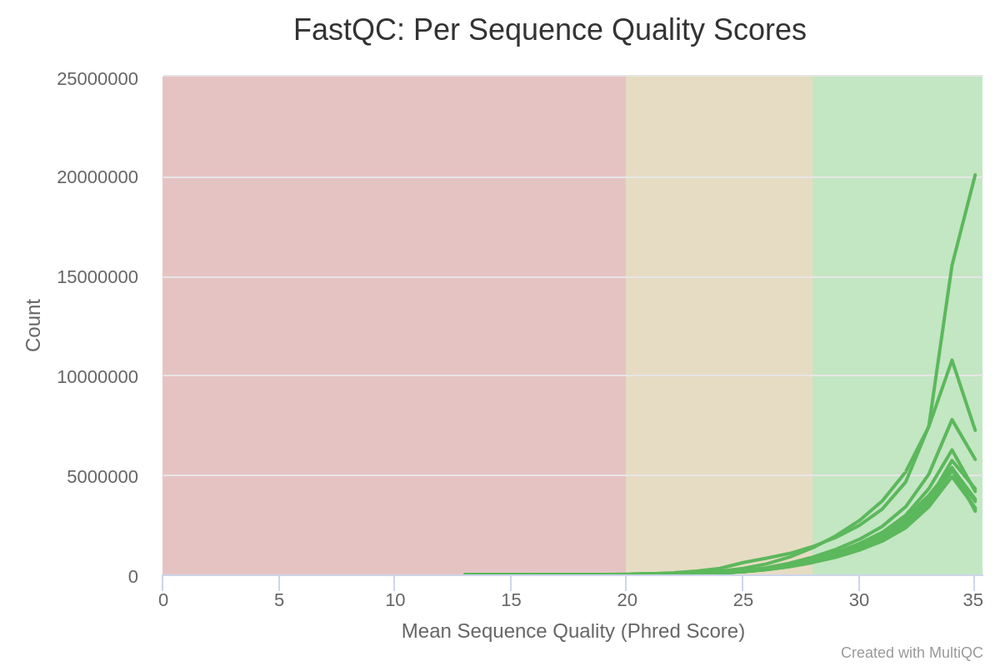
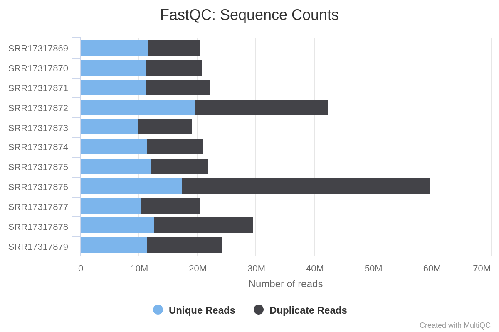

```{r setup, include=FALSE}
knitr::opts_chunk$set(echo = TRUE)
# load libraries
library(tximport)
library(DESeq2)
library(tidyverse)
library(biomaRt)
library(pheatmap)
library(clusterProfiler)
library(org.Hs.eg.db)
getwd()

# rmarkdown::render('rna-seq-analysis.Rmd',output_format = 'html_document', output_file = 'rna-seq-analysis.html')
```


This rna-seq analysis is carried out on **something** Cell Line where the depletion 
of BRAF (a proto-oncogene) on three time intervals:
  1. zero hours
  1. 24 hours
  1. 48 hours

## Download SRA & fasta files:

The sequence reads are first downloaded form NCBI SRA database using `prefetch` using the SRA id. Once the 11 SRA files are downloaded, using `fastq-dump --gzip --defline-qual '+'` the fasta files are downloaded.

## Check quality score for the reads using `fastqc`:

To check the quality of the reads `fastqc` is used to produce quality statistics and plots. From this all reads seem to have passed quality control with no adapters prescent. The sequence quality plot shows that all scores for each neuleotide was high (as shown below).  

```{bash , include=FALSE}
ls


```








## Align the read and get counts for each transcript using `salmon`:


## upload to R studio

```{r }
head(sra_table)
```

```{r}

sample_file = paste0('../',pull(sra_table,`Sample Name`),'/quant.sf')
names(sample_file) = pull(sra_table,`Sample Name`)
sample_file
```


## upload salmon output files uing `tximport`


```{r}
gene_map = read.csv('../../covid-rnaseq/gene_map.csv', col.names = c('enstid','ensgid'))
View(gene_map)

count_table = tximport(
  files = sample_file,
  type = 'salmon',
  tx2gene = gene_map,
  ignoreTxVersion = TRUE
  
)

```

## Sample GSM5750551 still showing 

```{r}
View(count_table$counts)

```


```{r}
dim(count_table$counts)
count_mat = as.data.frame(count_table$counts)
#View(count_mat)

#barplot(count_mat)
count_mat = as.matrix(count_mat)
dim(count_mat)
barplot(count_mat)
boxplot(count_mat)


```

## Use DEseq 

```{r}
unique(sra_table$treatment)
```
**Add a table with conditions in a eaier format**

```{r}
braf_condition = c()

for (treament in sra_table$treatment) {
  print(treament)
  if ('40h Vem' == treament) {
    braf_condition = c(braf_condition,'40h')
    
  }
  if ('24h Vem' == treament) {
    braf_condition = c(braf_condition,'24h')
    
  }
  if ('DMSO' == treament) {
    braf_condition = c(braf_condition,'0h')
    
  }
}


length(braf_condition)
braf_condition = factor(braf_condition, levels = c("0h","24h","40h"))
braf_condition

sra_table$condition = braf_condition
head(sra_table)

```


## upload tximport format to DESeq 

```{r}
dds = DESeqDataSetFromTximport(
  txi = count_table,
  colData = sra_table,
  design =~condition
)
```

```{r}
#?DESeqDataSetFromTximport
result_table


```


```{r}

dds = DESeq(dds)
dds
```

```{r}
result_table = results(dds)
result_table
dds
```


## Plot PCA:
Plot PCA to see what the general variation is between the conditions;

```{r}
vst_braf = varianceStabilizingTransformation(dds)
```
```{r, }

plotPCA(vst_braf, intgroup='condition') +
  theme_bw()

```

## Plot hcluster plot:

```{r}
d = assay(vst_braf)
d = t(d)
d = dist(d)
d

```

Looking at dendrogram the sample GSM5750551 shows clear divergance from any sample. This is due to errors in sequencing the the transcriptomics of the cell, therefore removing this sample can better represent the effect braf depletion has on the melanoma cells ()


```{r}
h = hclust(d)
plot(h,main='Cluster Dendrogram for 11 samples:')
```

**Without GSM5750551 the dendrogram shows a better devergence between the samples**

```{r}
d2 = assay(vst_braf)
d2 = t(d2[,1:10])
d2 = dist(d2)
d2

h2 = hclust(d2)
plot(h2,main='Cluster Dendrogram for 10 samples:')

```


```{r}
st1 = sra_table[,c('Sample Name','condition')]
st1


```

## nbinomWaldTest
Get the summary of the Wald test: 

```{r}
summary(result_table)

```


```{r}
df = as.data.frame(result_table)
head(df)
dim(df)
df_no_na = df[complete.cases(df) == TRUE,]
dim(df_no_na)

df_no_na$test = df_no_na$padj < 0.05 & abs(df_no_na$log2FoldChange) > 1
head(df_no_na)

```

## MA plot

```{r}
plotMA(result_table, main = 'MA plot')

```


## Plot vocano plot

```{r}
ggplot(df_no_na,aes(x=log2FoldChange, y=-log10(padj),name = test)) +
  geom_point(aes(color = test)) +
  geom_vline(xintercept = 1,linetype = 3) +
  geom_vline(xintercept = -1,linetype = 3) +
  geom_hline(yintercept = -log10(0.05),linetype = 3) +
  theme_bw()

```


```{r}
df_filtered = df_no_na[df_no_na$padj < 0.05 & abs(df_no_na$log2FoldChange) > 1,]
dim(df_filtered)
dim(df_no_na)


```


# search for gene names and ids using biomaRt:


```{r}
ensembl105 = useEnsembl(biomart = 'ensembl',version=105)

ensembl105 = useDataset('hsapiens_gene_ensembl', mart = ensembl105)
```
```{r}
#df_no_na = rownames_to_column(df_no_na, var = 'ensgene')
#View(df_no_na)

annotations = getBM(
  attributes = c('ensembl_gene_id',
                 'chromosome_name',
                 'start_position','end_position',
                 'strand','gene_biotype',
                 'external_gene_name',
                 'description'),
  filters = c('ensembl_gene_id'),
  values = df_no_na$ensgene,
  mart = ensembl105
)
```
```{r}

df_anno = left_join(df_no_na,annotations,by = c('ensgene'='ensembl_gene_id' ) )
df_anno
```


```{r}
annotated_df_filtered = df_anno[df_anno$padj < 0.05 & abs(df_anno$log2FoldChange) > 1,]
dim(annotated_df_filtered)
degs = annotated_df_filtered$ensgene

vst_anno = vst_braf[degs,]
vst_anno = assay(vst_anno)
vst_anno = as.data.frame(vst_anno)
head(vst_anno)
dim(vst_anno)  
dim(vst_braf)
dim(vst_anno)
```

```{r}

annotated_df_filtered[duplicated(annotated_df_filtered$external_gene_name),]
x = 0
for (ens in annotated_df_filtered$ensgene) {
  gene = annotated_df_filtered[annotated_df_filtered$ensgene == ens,'external_gene_name']
  #print(gene)
  if (length(gene) <= 1) {

    x = x +1
    gene = paste0('Unknown_gene',x)
    annotated_df_filtered[duplicated(annotated_df_filtered$external_gene_name),'external_gene_name'] = gene
  }
  
}
annotated_df_filtered[annotated_df_filtered$ensgene == 'ENSG00000167912',]
```
```{r}
rownames(vst_anno) = annotated_df_filtered$external_gene_name
```
```{r}
pheatmap(vst_anno,fontsize_row = 3,scale = 'row')
#ENSG00000167912
```


## GO Enrichment analysis:

* First find the differential gene id
* second find the gene id for all the transcripts 
* 

```{r}
ent_gene = getBM(attributes = c('entrezgene_id'),
                    filters = c('ensembl_gene_id'),
                    values = annotated_df_filtered$ensgene,
                    mart = ensembl105)
```
```{r}
ent_gene = ent_gene$entrezgene_id
ent_gene = as.character(ent_gene)
is.character(ent_gene)
```


```{r}
ent_uni = getBM(attributes = c('entrezgene_id'),
                    filters = c('ensembl_gene_id'),
                    values = df_anno$ensgene,
                    mart = ensembl105)
```
```{r}
ent_uni = ent_uni$entrezgene_id
ent_uni = as.character(ent_uni)
is.character(ent_uni)
```
## Biological processes:


```{r}
ego_BP = enrichGO(
  gene = ent_gene,
  OrgDb = org.Hs.eg.db,
  ont = 'BP',
  universe = ent_uni
)


```

```{r}
barplot(ego_BP,showCategory = 20,font.size = 7)
```

### cnet plot


```{r}
cnetplot(ego_BP,showCategory = 15,font.size = 5)
```


## Molecular functions


```{r}
ego_MF = enrichGO(
  gene = ent_gene,
  OrgDb = org.Hs.eg.db,
  ont = 'MF',
  universe = ent_uni
)


```


```{r}
barplot(ego_MF,showCategory = 20,font.size = 7)
```

## Cellular components


```{r}
ego_CC = enrichGO(
  gene = ent_gene,
  OrgDb = org.Hs.eg.db,
  ont = 'CC',
  universe = ent_uni
)


```


```{r}
barplot(ego_CC,showCategory = 20,font.size = 7)
```


